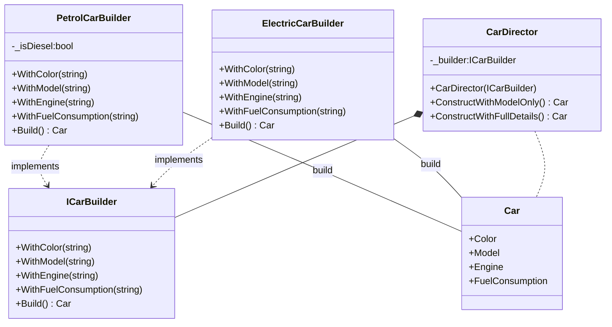

# Design Patterns
## Top 3 design patterns
Design patterns has been a way of programmers to exchange recipes of elegant solutions to problems encountered while writing software. My definition of `top` design pattern would be ones that are use more frequently, so here's my list:
1. Builder
2. Factory method
3. Singleton

## My favorite design pattern
My top 3 list above suggests that `Builder` is the design pattern I use the most. It's belongs to the family of creational patterns and allows to separate the concerns of creating an object and its representation. Builder encapsulates the complexity of creating an object giving some context about the instance (or `Product`) created from the builder. Lest's see an example with a builder and a Car class:

```c#
public class Car
{
    public string Color { get; } 
    public string Model { get; }
    public string Engine { get; }
    public string FuelConsumption { get; }
    
    public Car(string color, string model, string engine, string wheels, string fuelConsumption)
    {
        Color = color;
        Model = model;
        Engine = engine;
        FuelConsumption = fuelConsumption;
    }
}
```
A typical implementation of the builder pattern would define an interface with helper methods that builders will implement in their step by step creation of the object.

```c#
public interface ICarBuilder
{
    void WithColor(string color);
    void WithModel(string model);
    void WithEngine(string engine);
    void WithFuelConsumption(string fuelConsumption);
    Car Build();
}
```
The builder above is building a projection of car details that we want to show in a website for searching cars to buy. It's the small piece of information below an image when viewing the search results. We want builders to show the fuel consumption for petrol and diesel engines but something else for electric cars.

```c#
public class PetrolCarBuilder : ICarBuilder
{
    private string _color;
    private string _model;
    private string _engine;
    private string _fuelConsumption;
    private bool _isDiesel;
    
    public void WithColor(string color)
    {
        _color = color;
    }
    
    public void WithModel(string model)
    {
        _model = model;
    }
    
    public void WithEngine(string engine)
    {
        _engine = engine;
        _isDiesel = engine.Contains("Diesel");
    }
    
    public void WithFuelConsumption(string fuelConsumption)
    {
        _fuelConsumption = fuelConsumption;
    }
    
    public Car Build()
    {
        var fuelConsumption = _isDiesel ? $`{_fuelConsumption} (diesel)` : _fuelConsumption;
        
        return new Car(_color, _model, _engine, fuelConsumption);
    }
}
```
So, a petrol car builder can hide the complexity of deciding if an engine is a diesel or not and even abstract that pass the responsibility on `CarEngineIdentifier`.

An electric vehicle builder would probably doesn't care about fuel consumption and mark that property with a description of the energy source.
```c#

public class ElectricCarBuilder : ICarBuilder
{
    private string _color;
    private string _model;
    private string _engine;
    private string _fuelConsumption;
    
    public void WithColor(string color)
    {
        _color = color;
    }
    
    public void WithModel(string model)
    {
        _model = model;
    }
    
    public void WithEngine(string engine)
    {
        _engine = engine;
    }
    
    public void WithFuelConsumption(string fuelConsumption)
    {
        _fuelConsumption = fuelConsumption;
    }
    
    public Car Build()
    {
        return new Car(_color, _model, _engine, "electric");
    }
}
```
Although implementations above are quite naive and do not entail complexity in creating the objects above, the example above shows how in the different contexts of `Electric` and `Petrol` engines, car representation implementations differ and can be encapsulated in their own builder instances.

The pattern involves a director which depends on a `ICarBuilder` and that uses to create the object on the client it needs it. A concrete builder of petrol or electric cars is passed to the director making further decisions on the object creation.

```c#
public class CarDirector
{
    ICarBuilder _builder;
    
    public CarDirector(ICarBuilder builder)
    {
        _builder = builder;
    }
    
    public Car ConstructWithModelOnly()
    {
        _builder.WithModel("Ford");
        _builder.WithEngine("V8");
        
        return builder.Build();
    }
    
    public Car ConstructWithFullDetails()
    {
        _builder.WithModel("Ford");
        _builder.WithEngine("V8");
        _builder.WithColor("Red");
        _builder.WithFuelConsumption("5.2 L/100km");
        
        return builder.Build();
    }
}
```

## UML
Following uml diagrams are using [mermaid](https://mermaid-js.github.io/mermaid/#/) which github supports at the moment and might have some limitations on rendering all the UML semantics needed.

